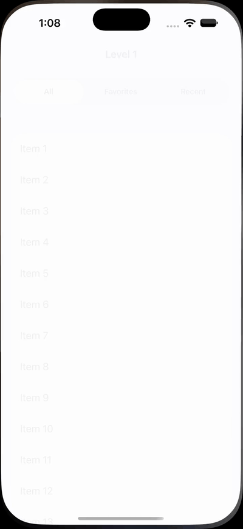
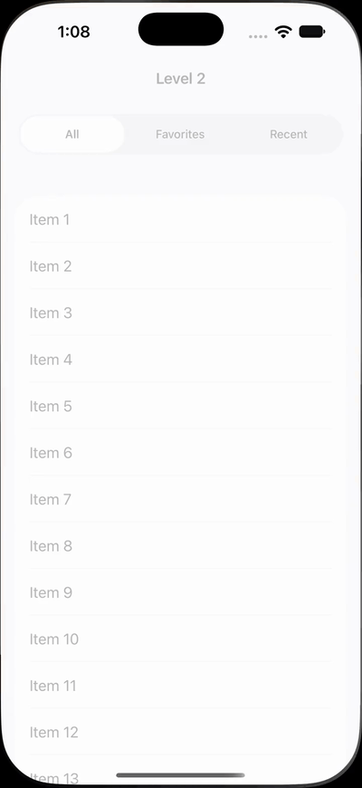
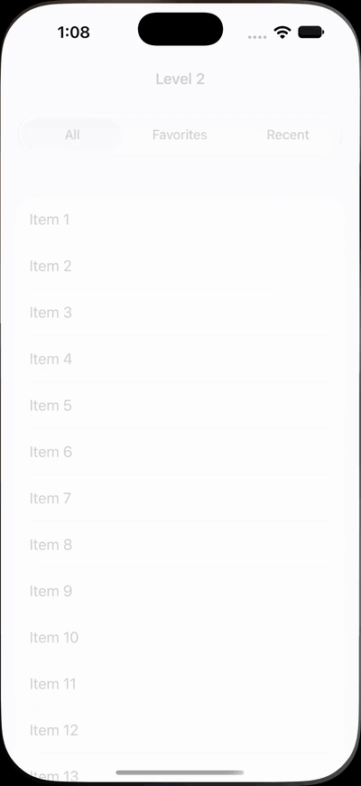
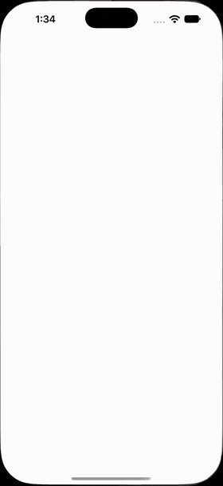
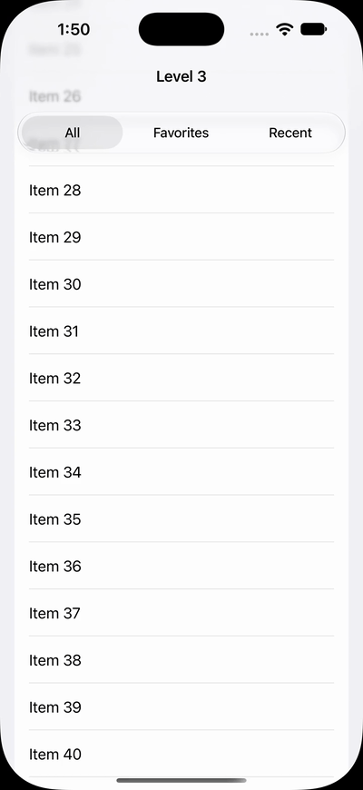
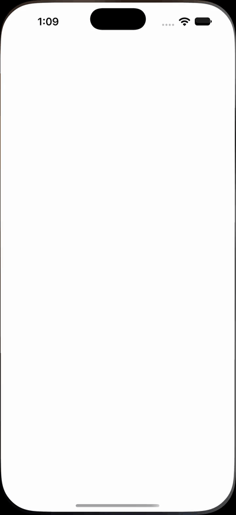
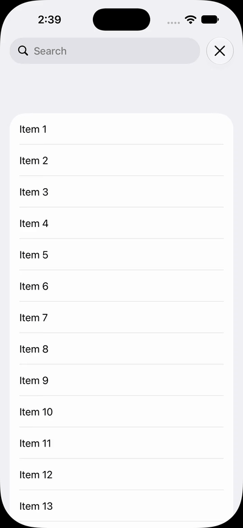
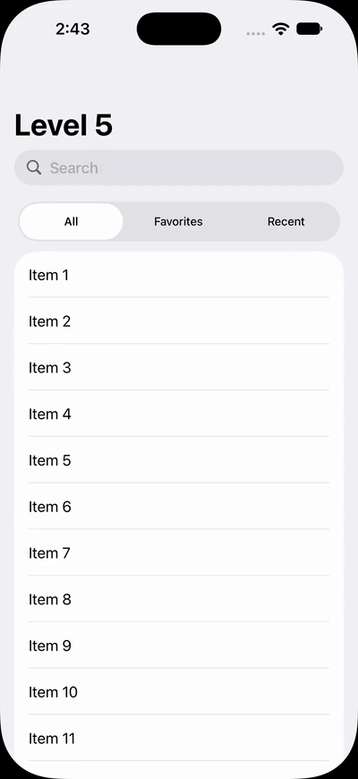
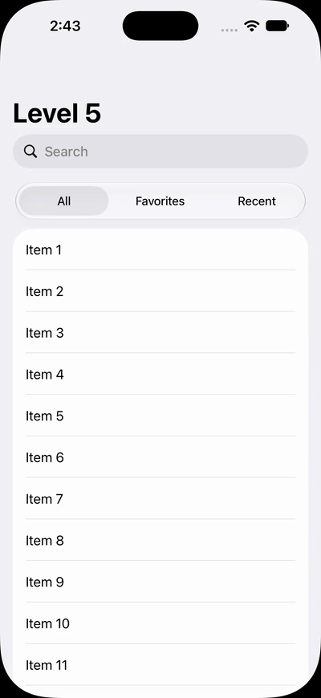

# `_UINavigationBarPalette` vs `UIScrollEdgeElementContainerInteraction`

*日本語版: [README.md](README.md)*

Supporting material for interoperability request **FB22730304** (make `_UINavigationBarPalette`
public) and the related Code-Level Support case.

In response to FB22730304 we were advised that `UIScrollEdgeElementContainerInteraction` can
achieve what the request asks for. This repository implements the same UI with both APIs and
**separates, level by level, what the public API can do and where it stops being able to do it.**

## Conclusion

**For Level 1, the advice is correct.** `UIScrollEdgeElementContainerInteraction` handles the
scroll edge effect completely, and there is no reason to reach for the palette at that level.
Level 2 is also workable with public API, at a cost.

The problem is Levels 3 and 4.

| Level | Goal | `UIScrollEdgeElementContainerInteraction` | `_UINavigationBarPalette` |
|---|---|---|---|
| 1 | Apply the scroll edge effect behind a custom bar | ✅ **Works** — this is what the API is for | — |
| 2 | Make the custom bar occupy layout space | △ Position and size match by hand (requires restructuring the screen), but the material does not | ✅ Automatic |
| 3 | Track the bar's bottom edge while a large title collapses | ✗ Lags and jitters | ✅ |
| 4 | Compose with a stacked search bar | ✗ Only one possible position, and no visibility control | ✅ Two slots: above the title and below the search bar |
| 5 | **The real use case** (Levels 3 + 4) | ✗ | ✅ |

### The dividing line is whether the navigation bar's own height changes

That single question separates the levels with a gap from the ones without.

As long as the bar's height is fixed, pinning a custom bar to the top of the safe area and pushing
the content inset down by a constant works. The moment the bar's height starts moving it breaks,
because **there is no public way for a view outside the bar to follow that**. Every level with a
gap is a height-changing case: Level 3 (a large title collapsing), Level 4 (a search bar
activating and dismissing).

Where the height does not change, no difference appears. Push/pop was tested too: despite the
difference in ownership — the palette belongs to `UINavigationItem`, the custom bar is a subview of
the view controller's view — nothing visible came of it, so it is not kept as a level.

What FB22730304 asks for is therefore not a visual effect, but **a way to be a component that the
navigation bar itself lays out**.

The material diverges already at Level 2. Inside the palette the picker participates in the
navigation bar's glass; in a container outside the bar it renders as an ordinary opaque control,
with a hard edge-effect line appearing at the bottom of the bar.

## The two APIs

### `UIScrollEdgeElementContainerInteraction` (iOS 26.0)

The entire public surface, per the iOS 27.0 SDK header:

```objc
UIKIT_FINAL UIKIT_EXTERN NS_SWIFT_UI_ACTOR API_AVAILABLE(ios(26.0), tvos(26.0), visionos(26.0))
@interface UIScrollEdgeElementContainerInteraction : NSObject <UIInteraction>
/// The scroll view to affect
@property (nonatomic, nullable, weak) UIScrollView *scrollView;
/// The edge of the scroll view to affect
@property (nonatomic) UIRectEdge edge;
@end
```

The header describes its purpose itself:

> Add this interaction to a container view of views that overlay the edge of a scroll view.
> Any descendants of this view that should **affect the shape of the edge effect**, such as labels,
> images, glass views, and controls, will automatically do so.

It is a mechanism for letting views participate in the shape of the scroll edge effect.

### `_UINavigationBarPalette`

A `UIView` conforming to `_UINavigationBarLayoutParticipating`
(`-updateLayoutData:layoutWidth:`), owned by `UINavigationItem` as `_topPalette` / `_bottomPalette`,
and laid out by `UINavigationBar` as part of the bar itself. It is a navigation bar component.

The two operate at different layers, which is why the first cannot substitute for the second.

## Running it

Open `Package.swift` in Xcode 27 or later and run the Xcode Previews in
`Sources/Comparison/Levels/`. Each preview name carries its verdict.

| Preview | Content |
|---|---|
| `Lv1 Public ✅` | What the public API does achieve — scroll to see the effect (no palette version needed) |
| `Lv2 Public △` / `Lv2 Palette` | Achievable by hand, at a cost |
| `Lv3 Public ✗` / `Lv3 Palette` | Large title |
| `Lv4 Public ✗` / `Lv4 Palette (bottom)` / `Lv4 Palette (top)` | Search bar. The palette's two slots are shown separately |
| `Lv5 Public ✗` / `Lv5 Palette` | **The real use case. This pair alone shows the whole picture** |

Each level's goal, result, verdict and reproduction steps are documented at the top of the
corresponding source file (in Japanese).

### Start here

Run **`Lv5 Public ✗`** and **`Lv5 Palette`** side by side and walk through them in this order:

1. At rest, compare where the picker sits relative to the search field.
2. Scroll up slowly and let the large title collapse (Level 3 — the lag).
3. Flick to the top and let it bounce (the lag is at its worst here).
4. Activate the search field, then dismiss it (Level 4 — the inset breaks).

This is a large title, a stacked search bar, and a picker directly below it: the pattern used by
Music, Photos, Mail and Fitness.

### Recordings

Recorded on an iOS 27.0 simulator (iPhone 18 Pro) running this repository's own code.
The tables show GIFs (400px); the full-resolution mp4 is linked under each level. The mp4s run
at 60fps and real speed.

A GIF can only hold whole hundredths of a second per frame, so 50fps (a 2cs delay) is the most it
can carry. Sampling 60fps straight down to 50 drops one frame in six on an uneven cadence, which
reads as judder, so the levels that do not already change speed are stretched by 1.2x first and
then taken at 50fps. Nothing is dropped; the trade is that they play at 83% of real speed.
All files live in `Docs/`.

#### Level 1 — Scrolling brings the edge effect up behind the picker

| Public API |
|---|
|  |

Full-resolution video: [lv1-public.mp4](Docs/lv1-public.mp4)

#### Level 2 — Same position and size; compare the picker's material and whether an edge line appears under the bar

| Public API | Palette |
|---|---|
|  |  |

Full-resolution video: [lv2-public.mp4](Docs/lv2-public.mp4) / [lv2-palette.mp4](Docs/lv2-palette.mp4)

#### Level 3 — One continuous drag: up until the title goes inline, back down without lifting, then release

| Public API | Palette |
|---|---|
|  |  |

Watch the stretch **as it happens**, after the drag reverses past the top. In the public API
version the large title is covered by the picker and fades out; in the palette version it stays
clear. The custom bar sits outside the navigation bar, so it stays on top of the title as the bar
grows.

At full stretch the two settle into the same position, so the difference is in the transition.
Releasing after that lets the system animate back to the top.

Level 3's GIF plays at 2x. The mp4 runs at real speed.

Full-resolution video: [lv3-public.mp4](Docs/lv3-public.mp4) / [lv3-palette.mp4](Docs/lv3-palette.mp4)

#### Level 4 — Search activating and dismissing. The palette can sit below the search bar or above the title

| Public API | Palette (bottom slot) | Palette (top slot) |
|---|---|---|
|  |  |  |

Level 4's GIFs play at 0.5x. The mp4s run at real speed.

Full-resolution video: [lv4-public.mp4](Docs/lv4-public.mp4) / [lv4-palette.mp4](Docs/lv4-palette.mp4) / [lv4-palette-top.mp4](Docs/lv4-palette-top.mp4)

#### Level 5 — Stretch and release, drag up to the inline title and reverse, then search (recorded by hand)

| Public API | Palette |
|---|---|
|  |  |

Watch the stretch downward. Top to bottom, the public API version goes **picker, title, search
bar**; the palette version keeps **title, search bar, picker**. The palette is part of the bar, so
the order holds; with the public API the picker is the one thing left outside the bar, and the
title and search bar slide underneath it.

Level 5 alone was recorded by hand; its GIFs play at 1.67x.

Full-resolution video: [lv5-public.mp4](Docs/lv5-public.mp4) / [lv5-palette.mp4](Docs/lv5-palette.mp4)

## Layout

```
Docs/                          # One recording per level (GIF and mp4)
Sources/
  UIKitCorePrivate/            # Private headers (generated from iOS 26.5 with ipsw)
  Comparison/
    PaletteViewController.swift      # Palette version (reference behavior)
    PublicAPIViewController.swift    # Public API version (best attempt)
    Support/
      ListViewController.swift       # Shared list screen
      FilterSegmentedControl.swift   # Shared picker
      BarContentView.swift           # Shared container, so both get identical margins
      BarMetrics.swift               # The single source of the bar's dimensions
      Scenario.swift                 # Gives both implementations identical conditions
    Levels/
      Level1_ScrollEdgeEffect.swift … Level5_RealWorldUseCase.swift
```

Both implementations take the same `Scenario`. The previews for each level differ only in which
options they enable.

The difference in implementation size is itself evidence. The palette version is three lines:

```swift
let bottomPalette = _UINavigationBarPalette(contentView: BarContentView())!
bottomPalette.preferredHeight = scenario.barHeight
navigationItem._bottomPalette = bottomPalette
```

The public API version needs four steps — re-hosting the list as a child view controller,
constraints, the interaction, and a manual inset — of which the public API covers only one
(see comments 1–4 in `PublicAPIViewController.swift`).

## What is being requested

Access to existing behavior only; no new behavior. The minimum public surface would be:

```swift
// UINavigationBarPalette
init(contentView: UIView)
var preferredHeight: CGFloat
var minimumHeight: CGFloat
var displaysWhenSearchActive: Bool

// UINavigationItem
var topPalette: UINavigationBarPalette?
var bottomPalette: UINavigationBarPalette?
```

## References

- Apple Developer Forums [#808436](https://developer.apple.com/forums/thread/808436) — the same
  question as this one ("how do I do SwiftUI's `.safeAreaBar(edge: .top)` in UIKit?"), answered
  with the same suggestion of `UIScrollEdgeElementContainerInteraction`. That thread also carries
  a report that the edge effect does not extend full width while the navigation bar is visible.
- SwiftUI has a public API for this pattern, `.safeAreaBar(edge:)`. UIKit has no equivalent, so
  UIKit apps must either depend on private API or migrate to SwiftUI.

## Verified with

- Xcode 27.0 (27A266a) / iOS 27.0 SDK
- Builds with `xcodebuild -scheme Comparison -destination 'generic/platform=iOS Simulator'`
